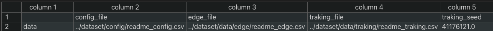

# dataset_visualization
## 概要

モビリティの研究を行うための人工的なトラッキングデータの生成をする。また生成したトラッキングデータの可視化ツールの提供を目的とする。
実世界のトラッキングデータが多く存在しない、または入手することが難しいことがこのライブラリの開発背景である。

## このツールでできること

### トラッキングデータの生成

設定ファイルを読み込み設定に応じたトラッキングデータをCSV形式で出力する。

### トラッキングデータの可視化

## 環境
- Python 3.10.3
- Pandas 1.5.1
- matplotlib 3.6.1
- numpy 1.23.4

## 使用方法

### 1. 設定ファイルの作成

設定項目は以下である
| 属性 | 値 |
| :--: | :--: |
| 'min_x' | x座標の最小値 (km) |
| 'max_x' | x座標の最大値 (km) |
| 'min_y' | y座標の最小値 (km) |
| 'max_y' | y座標の最大値 (km) |
| 'simulation_time' | 何秒分のデータを生成するか (s)|
| 'time_step' | 何秒おきにデータを書き出すか (s)|
| 'num_client' | モバイルクライアントの数 |
| 'num_edge' | エッジサーバの数 |
| 'speed' | モバイルクライアントの平均移動時速 (km/h) |

設定ファイルの例

この場合、12 km 四方の領域にモバイルクライアント50人、エッジサーバ9つ、1 s おきに位置情報を書き出すということを500 s 分行うことを設定している。

また下記のトラッキングデータの作成及び、可視化にはあらかじめこの設定ファイルを作成する必要がある。また作成の際には属性の順番を入れ替えてはいけない。

### 2. インデックスファイルの作成

このライブラリでは生成するトラッキングファイルのパスや、生成時に使用する乱数の seed 値、データを生成する際に使用した設定ファイルなどの情報を管理するためのファイルを作成し、インデックスファイルと呼ぶ。下記のようにCSV形式で情報を集約している。

util.py の create_index_file(index_file, config_file) という関数を呼び出すことで生成することができる。

| 引数 | パラメータ | デフォルト値 | 説明 |
| :--: | :--: | :--: | :--: |
| 第1引数 | index_file | 無し | index_file のパス |
| 第2引数 | config_file | 無し | 設定ファイルのパス |

### 3. トラッキングデータの生成

generator.py の generte_traking(index_file, config_file, out_file, seed=0) という関数を呼び出すことでトラッキングデータを生成することができる。

| 引数 | パラメータ | デフォルト値 | 説明 |
| :--: | :--: | :--: | :--: |
| 第1引数 | index_file | 無し | インデックスファイルのパス |
| 第2引数 | config_file | 無し | 設定ファイルのパス |
| 第3引数 | out_file | 無し | 出力先ファイルのパス |
| 第4引数 | seed | 0 | 乱数のシード値 |

seed値を引数に与えない場合のデフォルト値は0になっており、この場合seed値はランダムに決められ、データは生成される。また使用されたseed値はindex_fileに記録されるため後で確認することができ、このseed値を第4引数に与えることで再現することができる。

指定されたindex_fileのパスが存在しない場合、内部でcreate_index_fileが自動的に呼び出されるため事前にindex_fileを作成する必要はない。

生成したトラッキングデータはout_fileで指定したファイルに下記のように書き込まれる。

| 属性 | 値 |
| :--: | :--: |
| 'id' | クライアントの固有のID |
| 'time' | 時間 |
| 'x' | この時間のx座標 |
| 'y' | この時間のy座標 |

トラッキングデータファイルの例

### 4. トラッキングデータの可視化

animation.py の create_traking_animation(index_file, out_file, FPS) という関数を呼び出すことでトラッキングデータの可視化を行うことができる。

| 引数 | パラメータ | デフォルト値 | 説明 |
| :--: | :--: | :--: | :--: |
| 第1引数 | index_file | 無し | インデックスファイルのパス |
| 第2引数 | out_file | 無し | 出力先ファイルのパス |
| 第3引数 | FPS | 20 | 作成するアニメーションの1秒あたりに描画するフレーム数 |

これを実行することによって次のように可視化することができる。

