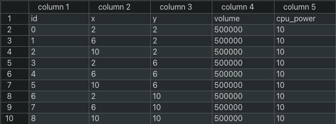
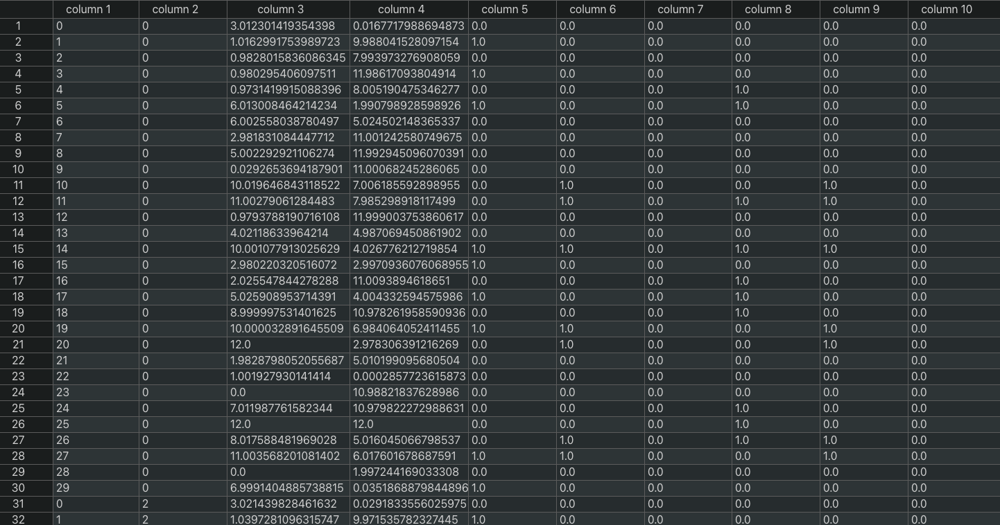
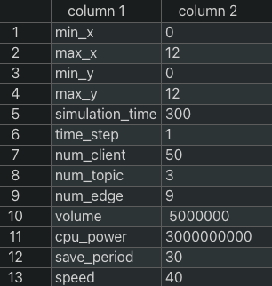

# dataset_visualization

## 概要

モビリティの研究を行うための人工的なトラッキングデータの生成をする。また生成したトラッキングデータの可視化ツールの提供を目的とする。
実世界のトラッキングデータが多く存在しない、または入手することが難しいことがこのライブラリの開発背景である。

本研究ではトピックベースの publish-process-subscribe システムモデルを扱っておりトピックごとに publisher, subscriber の分布に合わせて
エッジサーバにクライアントを適切に割り当てることで負荷の分散、冗長な通信経路の削減による低遅延な通信の実現を目的としている

そのためこのライブラリでは研究で使用するトラッキングデータの生成、トピックの生成、エッジサーバの生成、トラッキングデータに対するトピックの割り当て、
各種データの可視化をサポートしている。

## このツールでできること

### トラッキングデータの生成

設定ファイルを読み込み設定に応じたトラッキングデータを CSV 形式で出力する。

### トピックの生成

設定ファイルを読み込み、設定に応じたトピックの設定を CSV 形式で生成する。

### エッジサーバの生成

設定ファイルを読み込み、設定に応じたエッジサーバの設定を CSV 形式で出力する。

### トラッキングデータに対するトピックの割り当て

生成したトラッキング、トピックの情報をもとに各クライアントにトピックを割り当てる。
つまり、各クライアントが各トピックを publish, subscribe をそれぞれ行うのかを決める

### トラッキングデータの可視化

クライアントとエッジサーバの位置をそれぞれ黒の丸、緑の四角で表している

### トピックの割り当て情報をもったトラッキングデータの可視化

トピックの割り当てを行ったトラッキングデータにおいて各トピックの publisher/subscriber をそれぞれ赤、青色として表示する。
また publisher 兼 subscriber は紫で表す。

## 環境

- Python 3.10.3
- Pandas 1.5.1
- matplotlib 3.6.1
- numpy 1.23.4

## 使用方法

### 1. 設定ファイルの作成

設定項目は以下である
| 属性 | 値 |
| :--: | :--: |
| 'min_x' | x 座標の最小値 (km) |
| 'max_x' | x 座標の最大値 (km) |
| 'min_y' | y 座標の最小値 (km) |
| 'max_y' | y 座標の最大値 (km) |
| 'simulation_time' | 何秒分のデータを生成するか (s)|
| 'time_step' | 何秒おきにデータを書き出すか (s)|
| 'num_client' | モバイルクライアントの数 |
| 'num_topic' | トピックの数 |
| 'num_edge' | エッジサーバの数 |
| 'volume' | エッジサーバのストレージ容量 (Mbyte) |
| 'cpu_cycle' | エッジサーバのCPU周波数 (Hz) |
| 'save_period' | データがエッジサーバに保存される時間 (s) |
| 'speed' | モバイルクライアントの平均移動時速 (km/h) |

設定ファイルの例

この場合、12 km 四方の領域にモバイルクライアント 50 人、エッジサーバ 9 つ、1 s おきに位置情報を書き出すということを 500 s 分行うことを設定している。

また下記のトラッキングデータの作成及び、可視化にはあらかじめこの設定ファイルを作成する必要がある。また作成の際には属性の順番を入れ替えてはいけない。

### 2. インデックスファイルの作成

このライブラリでは生成するトラッキングファイルのパスや、生成時に使用する乱数の seed 値、データを生成する際に使用した設定ファイルなどの情報を管理するためのファイルを作成し、インデックスファイルと呼ぶ。下記のように CSV 形式で情報を集約している。

util.py の create_index_file(index_file, config_file) という関数を呼び出すことで生成することができる。

|   引数    | パラメータ  | デフォルト値 |        説明        |
| :-------: | :---------: | :----------: | :----------------: |
| 第 1 引数 | index_file  |     無し     | index_file のパス  |
| 第 2 引数 | config_file |     無し     | 設定ファイルのパス |

### 3. トラッキングデータの生成

generator.py の generte_traking(index_file, config_file, out_file, seed=0) という関数を呼び出すことでトラッキングデータを生成することができる。

|   引数    | パラメータ  | デフォルト値 |            説明            |
| :-------: | :---------: | :----------: | :------------------------: |
| 第 1 引数 | index_file  |     無し     | インデックスファイルのパス |
| 第 2 引数 | config_file |     無し     |     設定ファイルのパス     |
| 第 3 引数 |  out_file   |     無し     |    出力先ファイルのパス    |
| 第 4 引数 |    seed     |      0       |       乱数のシード値       |

seed 値を引数に与えない場合のデフォルト値は 0 になっており、この場合 seed 値はランダムに決められ、データは生成される。また使用された seed 値は index_file に記録されるため後で確認することができ、この seed 値を第 4 引数に与えることで再現することができる。

指定された index_file のパスが存在しない場合、内部で create_index_file が自動的に呼び出されるため事前に index_file を作成する必要はない。

生成したトラッキングデータは out_file で指定したファイルに下記のように書き込まれる。

|  属性  |           値            |
| :----: | :---------------------: |
|  'id'  | クライアントの固有の ID |
| 'time' |          時間           |
|  'x'   |    この時間の x 座標    |
|  'y'   |    この時間の y 座標    |

トラッキングデータファイルの例

### 4. トラッキングデータにトピックを割り当てる

generator.py の　 assignTopic(index_file, out_file, seed=0) という関数を呼び出すことでトラッキングデータにトピックを割り当てることができる。

|   引数    | パラメータ | デフォルト値 |            説明            |
| :-------: | :--------: | :----------: | :------------------------: |
| 第 1 引数 | index_file |     無し     | インデックスファイルのパス |
| 第 2 引数 |  out_file  |     無し     |    出力先ファイルのパス    |
| 第 3 引数 |    seed    |      0       |       乱数のシード値       |

seed 値を引数に与えない場合のデフォルト値は 0 になっており、この場合 seed 値はランダムに決められ、データは生成される。また使用された seed 値は index_file に記録されるため後で確認することができ、この seed 値を第 3 引数に与えることで再現することができる。

index_file が存在しない場合、プログラムは停止しエラーメッセージを出力する。したがって事前に index_file を生成しておく必要がある。
トピックを割り当てるためのトラッキングデータを生成した際に index_file は自動的に生成されている。

### 5. トラッキングデータの可視化

animation.py の create_traking_animation(index_file, out_file, FPS) という関数を呼び出すことでトラッキングデータの可視化を行うことができる。

|   引数    | パラメータ | デフォルト値 |                          説明                           |
| :-------: | :--------: | :----------: | :-----------------------------------------------------: |
| 第 1 引数 | index_file |     無し     |               インデックスファイルのパス                |
| 第 2 引数 |  out_file  |     無し     |                  出力先ファイルのパス                   |
| 第 3 引数 |    FPS     |      20      | 作成するアニメーションの 1 秒あたりに描画するフレーム数 |

これを実行することによって次のように可視化することができる。

### 6. トピック付きトラッキングデータの可視化

animation.py の create_topic_animation(index_file, out_file, FPS) という関数を呼び出すことでトピックの割り当て付きのトラッキングデータの
可視化を行うことができる。

|   引数    | パラメータ | デフォルト値 |                          説明                           |
| :-------: | :--------: | :----------: | :-----------------------------------------------------: |
| 第 1 引数 | index_file |     無し     |               インデックスファイルのパス                |
| 第 2 引数 |  out_file  |     無し     |                  出力先ファイルのパス                   |
| 第 3 引数 |    FPS     |      20      | 作成するアニメーションの 1 秒あたりに描画するフレーム数 |
