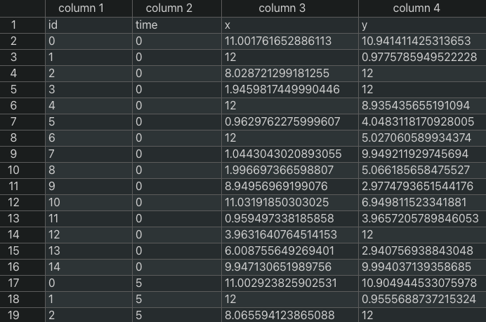
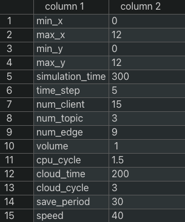

# dataset_visualization

## 概要

モビリティの研究を行うための人工的なトラッキングデータの生成をする。また生成したトラッキングデータの可視化ツールの提供を目的とする。
実世界のトラッキングデータが多く存在しない、または入手することが難しいことがこのライブラリの開発背景である。

本研究ではトピックベースの publish-process-subscribe システムモデルを扱っておりトピックごとに publisher, subscriber の分布に合わせて
エッジサーバにクライアントを適切に割り当てることで負荷の分散、冗長な通信経路の削減による低遅延な通信の実現を目的としている

そのためこのライブラリでは研究で使用するトラッキングデータの生成、トピックの生成、エッジサーバの生成、トラッキングデータに対するトピックの割り当て、
各種データの可視化をサポートしている。

## このツールでできること

### トラッキングデータの生成

設定ファイルを読み込み設定に応じたトラッキングデータを CSV 形式で出力する。

### トピックの生成

設定ファイルを読み込み、設定に応じたトピックの設定を CSV 形式で生成する。

### エッジサーバの生成

設定ファイルを読み込み、設定に応じたエッジサーバの設定を CSV 形式で出力する。

### トラッキングデータに対するトピックの割り当て

生成したトラッキング、トピックの情報をもとに各クライアントにトピックを割り当てる。
つまり、各クライアントが各トピックを publish, subscribe をそれぞれ行うのかを決める

### トラッキングデータの可視化

クライアントとエッジサーバの位置をそれぞれ黒の丸、緑の四角で表している

### トピックの割り当て情報をもったトラッキングデータの可視化

トピックの割り当てを行ったトラッキングデータにおいて各トピックの publisher/subscriber をそれぞれ赤、青色として表示する。
また publisher 兼 subscriber は紫で表す。

## 環境

- Python 3.10.3
- Pandas 1.5.1
- matplotlib 3.6.1
- numpy 1.23.4

## 使用方法

### 1. 設定ファイルの作成

設定項目は以下である
| 属性 | 値 |
| :--: | :--: |
| 'min_x' | x 座標の最小値 (km) |
| 'max_x' | x 座標の最大値 (km) |
| 'min_y' | y 座標の最小値 (km) |
| 'max_y' | y 座標の最大値 (km) |
| 'simulation_time' | 何秒分のデータを生成するか (s)|
| 'time_step' | 何秒おきにデータを書き出すか (s)|
| 'num_client' | モバイルクライアントの数 |
| 'num_topic' | トピックの数 |
| 'num_edge' | エッジサーバの数 |
| 'volume' | エッジサーバのストレージ容量 (Mbyte) |
| 'cpu_cycle' | エッジサーバのCPU周波数 (Hz) |
| 'save_period' | データがエッジサーバに保存される時間 (s) |
| 'speed' | モバイルクライアントの平均移動時速 (km/h) |

設定ファイルの例

この場合、12 km 四方の領域にモバイルクライアント 50 人、エッジサーバ 9 つ、1 s おきに位置情報を書き出すということを 500 s 分行うことを設定している。

また下記のトラッキングデータの作成及び、可視化にはあらかじめこの設定ファイルを作成する必要がある。また作成の際には属性の順番を入れ替えてはいけない。

### 2. インデックスファイルの作成

このライブラリでは生成するトラッキングファイルのパスや、生成時に使用する乱数の seed 値、データを生成する際に使用した設定ファイルなどの情報を管理するためのファイルを作成し、インデックスファイルと呼ぶ。下記のように CSV 形式で情報を集約している。

util.py の create_index_file(index_file, config_file) という関数を呼び出すことで生成することができる。

|   引数    | パラメータ  | デフォルト値 |        説明        |
| :-------: | :---------: | :----------: | :----------------: |
| 第 1 引数 | index_file  |     無し     | index_file のパス  |
| 第 2 引数 | config_file |     無し     | 設定ファイルのパス |

### 3. トラッキングデータの生成

generator.py の generte_traking(index_file, config_file, out_file, seed=0) という関数を呼び出すことでトラッキングデータを生成することができる。

|   引数    | パラメータ  | デフォルト値 |            説明            |
| :-------: | :---------: | :----------: | :------------------------: |
| 第 1 引数 | index_file  |     無し     | インデックスファイルのパス |
| 第 2 引数 | config_file |     無し     |     設定ファイルのパス     |
| 第 3 引数 |  out_file   |     無し     |    出力先ファイルのパス    |
| 第 4 引数 |    seed     |      0       |       乱数のシード値       |

seed 値を引数に与えない場合のデフォルト値は 0 になっており、この場合 seed 値はランダムに決められ、データは生成される。また使用された seed 値は index_file に記録されるため後で確認することができ、この seed 値を第 4 引数に与えることで再現することができる。

指定された index_file のパスが存在しない場合、内部で create_index_file が自動的に呼び出されるため事前に index_file を作成する必要はない。

生成したトラッキングデータは out_file で指定したファイルに下記のように書き込まれる。

|  属性  |           値            |
| :----: | :---------------------: |
|  'id'  | クライアントの固有の ID |
| 'time' |          時間           |
|  'x'   |    この時間の x 座標    |
|  'y'   |    この時間の y 座標    |

トラッキングデータファイルの例

### 4. トラッキングデータにトピックを割り当てる

generator.py の assignTopic(index_file, out_file, seed=0) という関数を呼び出すことでトラッキングデータにトピックを割り当てることができる。

|   引数    | パラメータ | デフォルト値 |            説明            |
| :-------: | :--------: | :----------: | :------------------------: |
| 第 1 引数 | index_file |     無し     | インデックスファイルのパス |
| 第 2 引数 |  out_file  |     無し     |    出力先ファイルのパス    |
| 第 3 引数 |    seed    |      0       |       乱数のシード値       |

seed 値を引数に与えない場合のデフォルト値は 0 になっており、この場合 seed 値はランダムに決められ、データは生成される。また使用された seed 値は index_file に記録されるため後で確認することができ、この seed 値を第 3 引数に与えることで再現することができる。

index_file が存在しない場合、プログラムは停止しエラーメッセージを出力する。したがって事前に index_file を生成しておく必要がある。
トピックを割り当てるためのトラッキングデータを生成した際に index_file は自動的に生成されている。

### 5. トラッキングデータの可視化

animation.py の create_traking_animation(index_file, out_file, FPS) という関数を呼び出すことでトラッキングデータの可視化を行うことができる。

|   引数    | パラメータ | デフォルト値 |                          説明                           |
| :-------: | :--------: | :----------: | :-----------------------------------------------------: |
| 第 1 引数 | index_file |     無し     |               インデックスファイルのパス                |
| 第 2 引数 |  out_file  |     無し     |                  出力先ファイルのパス                   |
| 第 3 引数 |    FPS     |      20      | 作成するアニメーションの 1 秒あたりに描画するフレーム数 |

これを実行することによって次のように可視化することができる。

### 6. トピック付きトラッキングデータの可視化

animation.py の create_topic_animation(index_file, out_file, FPS) という関数を呼び出すことでトピックの割り当て付きのトラッキングデータの
可視化を行うことができる。

|   引数    | パラメータ | デフォルト値 |                          説明                           |
| :-------: | :--------: | :----------: | :-----------------------------------------------------: |
| 第 1 引数 | index_file |     無し     |               インデックスファイルのパス                |
| 第 2 引数 |  out_file  |     無し     |                  出力先ファイルのパス                   |
| 第 3 引数 |    FPS     |      20      | 作成するアニメーションの 1 秒あたりに描画するフレーム数 |

## 各ファイルの説明

### client.py

トラッキングデータ、pub/sub 関係の割り当てにおいてクライアントの情報を扱うためのクラスを記述しているファイル。

#### Client_traking クラス

トラッキングデータを生成するためのクラス。このクラスでは下記の属性を持つ

|    属性    |         説明           |
| :-------: | :--------------------: |
|     id    |  各クライアントの固有のID  |
|     x     |     現在の x 座標     |
|     y     |     現在の y 座標     |
| direction | 現在の進行方向 (0~360度) |
|   speed   |    現在の速度 (km/h)    |

また、トラッキングデータを生成する際に使用する random_wark というメソッドを持つ。

|   引数   | パラメータ | デフォルト値 |            説明               |
| :------: | :------: | :-------: | :-----------------------------: |
| 第 1 引数 | time_step |   無し   |    何秒ごとに移動先を決めるか (s)    |
| 第 2 引数 |   min_x   |   無し   | シミュレーション領域の x 座標の最小値 |
| 第 3 引数 |   max_x   |   無し   | シミュレーション領域の x 座標の最大値 |
| 第 4 引数 |   min_y   |   無し   | シミュレーション領域の y 座標の最小値 |
| 第 5 引数 |   max_y   |   無し   | シミュレーション領域の y 座標の最大値 |

このメソッドは呼ばれるたびに次の時刻でのクライアントの位置座標を決定する。

座標の決め方は、乱数を用いて現在の進行方向を元に次に進む向きを決定し、その向きに対してどれだけ進むかを現在の速度を元に決定する。
また、メソッドが呼ばれるたびに現在の速度を平均、標準偏差を10としたガウス分布をもちに次の速度を決定している。

#### Client_topic クラス

トラッキングデータに pub/sub 関係を割り当てるために使用するクラス。このクラスでは下記の属性を持つ

|    属性    |         説明           |
| :-------: | :--------------------: |
|     id    |  各クライアントの固有のID  |
|     x     |     現在の x 座標     |
|     y     |     現在の y 座標     |
| pub_topic | 各 topic をpublish しているかどうか |
| sub_topic | 各 topic を subscribe しているかどうか    |

また、トラッキングデータに対して pub/sub 関係を割り当てる際に使用する select_topic というメソッドを持つ

|   引数   | パラメータ | デフォルト値 |            説明               |
| :------: | :------: | :-------: | :-----------------------------: |
| 第 1 引数 | all_topic |   無し   |    全ての topic のインスタンスを格納しているリスト    |

このメソッドが呼ばれた際に、all_topic から各トピックを取り出し、それぞれの topic の特徴に応じて該当のクライアントがそれぞれの
topic を publish, subscribe を行うのかを決定する。また新しい topic を作成する際にはこのメソッドの中に pub/sub の決定の仕方
を追記する必要がある。

### data.py

生成した各種データを扱うためのクラスを記述しているファイル

#### Data_traking クラス

トラッキングデータを扱うためのクラス

|    属性    |         説明           |
| :-------: | :--------------------: |
|     id    |  クライアントの固有のID  |
|    time   |          時刻           |
|     x     |         x 座標         |
|     y     |         y 座標         |

このクラスは、トラッキングデータを保存するファイルで一行に書き込まれる情報に対応する。すなわち
クライアント i が時刻 t に (x, y) にいることを一つのインスタンスとして扱うものである。

### Data_topic クラス

pub/sub 関係付きトラッキングデータを扱うためのクラス

|    属性    |         説明           |
| :-------: | :--------------------: |
|     id    |  クライアントの固有のID  |
|    time   |          時刻           |
|     x     |         x 座標         |
|     y     |         y 座標         |
| pub_topic | 各 topic をpublish しているかどうか |
| sub_topic | 各 topic を subscribe しているかどうか    |

このクラスは、pub/sub 関係つきトラッキングデータを保存するファイルで一行に書き込まれる情報に対応する。
すなわちクライアント i が時刻 t に (x, y) におり、各 topic をpublish/subscribe しているかどうかという情報を
一つのインスタンスとして扱うものである。

また、pub_topic, sub_topic はともに長さが topic の数である numpy 配列であり、id=0のtopicをpublishする場合
pub_topic[0] = True (1) となる。sub_topic についても同様である。

### Data_solution クラス

各 topic のデータをどのエッジサーバに対して publish/subscribe するのかのトラッキングデータを扱うクラス

|    属性    |         説明           |
| :-------: | :--------------------: |
|     id    |  クライアントの固有のID  |
|    time   |          時刻           |
|     x     |         x 座標         |
|     y     |         y 座標         |
| pub_topic | 各 topic のデータをどのエッジサーバに　publish しているか |
| sub_topic | どのエッジサーバからデータを subscribe している   |

このクラスはエッジサーバに対する割り当てを保存するファイルで一行に書き込まれる情報に相当する。
すなわち、クライアント i が時刻 t に (x, y) におり、各トピックをどのエッジサーバに対して publish/subscribe をするのかを
一つのインスタンスとして扱うものである。

また、publish 先のエッジサーバは topic ごとに決定するが、subscribe するサーバは全ての topic で同じサーバを選択する。

id = 0 の topic をid=3のエッジサーバに publish する場合では pub_topic[0] = 3 となる。
一方、subscribe 先のサーバは全ての topic で共通であるため、id = 1のサーバから subscribe する場合 sub_topic = 1 となる。

## edge.py

### Edge クラス

各 edge のデータを扱うためのクラス

|    属性    |         説明           |
| :-------: | :--------------------: |
|     id    |  エッジサーバの固有のID  |
|     x     |         x 座標         |
|     y     |         y 座標         |
|  volume   | エッジサーバのストレージ容量 |
| cpu_power | エッジサーバのクロック数   |

`edge = Edge(0, 8.5, 8.5, 1000, 10000)`

上記のように Edge オブジェクトを生成することで、エッジサーバごとのデータをまとめて扱うことができます。

## topic.py

### Topic クラス

各 topic の抽象クラスで共通の属性、メソッドを定義しているクラスである。

|      属性      |         説明           |
| :-----------: | :--------------------: |
|      id       |  topic 固有のID  |
|  save_period  |  データをストレージに保存する期間 (s)  |
| publish_rate  |   publish を行う間隔 (/s)     |
|   data_size   | 1メッセージあたりのデータサイズ (MB) |
| require_cycle | 1メッセージを処理するのに必要なクロック数  |

__init__ メソッドにおいて publish_rate, data_size, require_cycle が None で与えられた場合、
ランダムな値が設定される。publish_rate は 0.1~10 の値となり、data_size は 1~256 (これは MQTT の最大データサイズ)
require_cycle は 1e4~1e5なる。

init_topic は @abstractclassmethod デコレータと付けられており、topic クラスを継承する全てのクラスで実装する必要がる。
このメソッドは、各クライアントが初期にその topic を pub/sub するのかを決定するためのメソッドある

### Topic_uniform クラス

このクラスはこの topic を pub/sub するクライアントが一様に分布するような特徴を持つ topic を扱うためのクラス

|      属性      |         説明           |
| :-----------: | :--------------------: |
|      role       |  特徴を表すための属性  |

この topic では Topic クラスで持つ属性の他に role 属性を持つ。これは各 topic がどの様な特徴を持つのかを表すためのものである。
Topic_uniform クラスでは `role = 0` とする。

Topic_uniform クラスでの init_topic メソッドはランダムに pub/sub を決定する。

### Topic_local クラス

このクラスはこの topic を pub/sub するクライアントが局所的な位置に分布する様な特徴を持つ topic を扱うためのクラス。

|      属性      |         説明           |
| :-----------: | :--------------------: |
|     role     |  特徴を表すための属性  |
|    radius    |  局所的な領域の半径 (km)  |
|  base_point  |  局所的な領域の中心座標  |

この topic では Topic クラスで持つ属性の他に role 属性を持つ。これは各 topic がどの様な特徴を持つのかを表すためのものである。
Topic_uniform クラスでは `role = 1` とする。また、局所的な領域の中心座標と半径の情報を持つ。

Topic_uniform クラスでの init_topic メソッドは領域の半径内にいるクライアントが該当 topic を pub/sub する。

### Topic_incident クラス

このクラスはこの topic を pub/sub するクライアントが局所的かつ突発的に発生する特徴を持つ topic を扱うためのクラス。

|      属性      |         説明           |
| :-----------: | :--------------------: |
|      role      |  特徴を表すための属性  |
|  random_point  |  局所的かつ突発的に発生する領域を保持するリスト  |

この topic では Topic クラスで持つ属性の他に role 属性を持つ。これは各 topic がどの様な特徴を持つのかを表すためのものである。
Topic_uniform クラスでは `role = 2` とする。また、局所的かつ突発的に発生する領域を保持するためのリストを持つ。

Topic_incident クラスでの init_topic メソッドでは、誰も初期段階では pub/sub を行なわないようにしている。

また decide_random_point メソッドでは領域の更新を行う。具体的には、既存の領域の残り時間を減らし、新規に領域を生成するかを
ランダムに決定する。最後に、領域の残り時間が 0 になったものは random_point リストから削除する。

### Point クラス

このクラスは Topic_incident クラスで扱う局所的かつ突発的に発生する領域の情報を扱うためのクラスである。

|      属性      |         説明           |
| :-----------: | :--------------------: |
|     x     |  領域の中心の x 座標  |
|     y    |  領域の中心の y 座標  |
|  radius  |  領域の半径  |
|  time  |  領域の残り時間 (s)  |

このクラスは領域の位置と範囲の他に time という属性で領域の残り時間を保持している。 time が 0 以上の時領域が生成されており
この範囲内に位置するクライアントが Topic_incident クラスで表現される topic を pub/sub することになる。

`time_advance` メソッドでは引数として `advance_time` を受け取り、領域の残り時間を `advance_time` 分だけ減らす。

`check_area` メソッドでは領域の範囲内にいるかチェックしたクライアントの座標を引数として `x, y` を与える。
これにより、領域の範囲内にクライアントがいれば `True`, そうでなければ `False` を返す。

## generator.py

このファイルはトラッキングデータや pub/sub 関係付きのトラッキングデータ、エッジサーバ、 topic のデータを生成するための関数を記述しているファイルである。

|      関数      |         機能           |
| :-----------: | :--------------------: |
|  generate_traking  |  トラッキングデータを生成する  |
|   assignTopic    |  トラッキングデータに対して pub/sub 関係を付与する  |
|  generate_edge  |  エッジサーバの情報を生成する  |
|  generate_topic  |  topic の情報を生成する  |

### generate_traking 関数

|   引数   | パラメータ | デフォルト値 |            説明               |
| :------: | :------: | :-------: | :-----------------------------: |
| 第 1 引数 |  index_file |   無し   |    各種データを集約をするためのファイルのパス    |
| 第 2 引数 | config_file |   無し   |    トラッキングデータを生成するための設定を記述するファイルのパス    |
| 第 3 引数 |  out_file  |   無し   |    生成したトラッキングデータを記述するファイルのパス    |
| 第 4 引数 |   seed   |   0   |    トラッキングデータを生成する際に使用する乱数のシード値    |

この関数は上記の4つの引数の受け取りトラッキングデータを生成する。

index_file とは config_file や edge_file, topic_file などのパスや各種情報を集約して管理するためのファイルである。
`generate_traking` 関数では引数として与えられた `index_file` のパスが存在しない場合、与えられたパスにしたがって
`index_file` を生成する. また、与えらた `seed` が 0 の場合ランダムにシード値を決定し、その値に基づいてトラッキングデータを生成する。

トラッキングデータを生成する際に使用した `config_file`, `seed`, `out_file` は `index_file` に書き込まれ保存される。

次に、与えれた `config_file` から各種設定を読み込む。具体的には下記の東リである。

| 属性 | 値 |
| :--: | :--: |
| 'min_x' | x 座標の最小値 (km) |
| 'max_x' | x 座標の最大値 (km) |
| 'min_y' | y 座標の最小値 (km) |
| 'max_y' | y 座標の最大値 (km) |
| 'simulation_time' | 何秒分のデータを生成するか (s)|
| 'time_step' | 何秒おきにデータを書き出すか (s)|
| 'num_client' | モバイルクライアントの数 |
